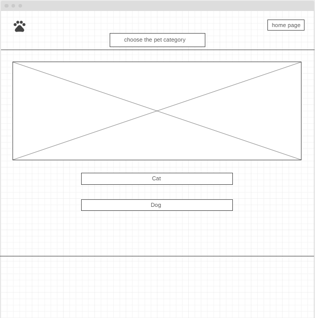
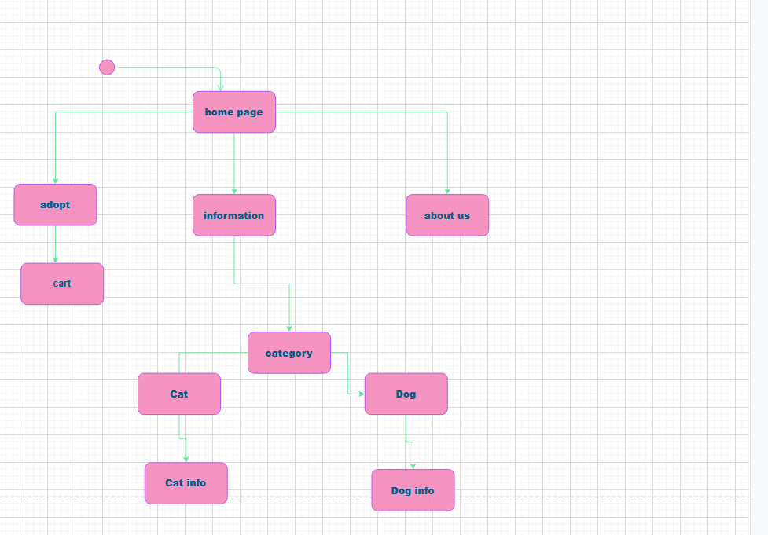

# requirement

## task 1 - 1
## business-related problem 

Every project is original and unique, however initiatives that fail typically fail due to similar sorts of difficulties.
Finding instances of failed initiatives is simple, but assessing the factors that lead to failure may be more complex. 

*these are problems that any project may face:*

### Lack of communication in the project
Effective communication in project management is critical for project success.
To guarantee that all stakeholders are participating in the process, you must have timely and transparent communication systems in place. 

### possible solution:

Project managers frequently rely on different collaboration and project management tools available on the market to keep everyone up to speed. 

### Poor planning at the beginning stage** involves failing to prioritize properly, failing to establish a good business strategy, and failing to divide development into phases. 

### possible solution:
like dealing with different approaches CLEAR and SMART so it can assist a project manager in developing a set of successful goals from the outset of a project and this can assist in overcoming project management hurdles. 

### taking Too much time spent resolving issues after projects have gone live
There will undoubtedly be a few problems here and there, but this is a common issue created by a concentration on production. 

### possible solution

Firstly, make extra time from the start to test your work.If necessary, double your normal testing time.
Yes, it will strain your schedule even more, but it will be worth it in the long run. 

### Unclear and changing the requirements
in every project we may face this problem if we do not have clear requirements from the first so that will lead the project fail.

### possible solution
define the requirements at the beginning stage in a clear way by the leader and the team or try to use agile 

### user and system requirement
user requirements:
- add to cart 
- flip cards
- buttons
- slide show pictures
- animation 

system requirements:
- local storage 
- functionality 

---

## task 1 - 2
### identifying areas of risks

- Schedule Risk
The chance that tasks will take longer than planned is known as schedule risk, and it is usually the result of poor planning. It is strongly connected to cost risk, because schedule slippages generally raise costs and also delay the project's end, including its benefits. Delays lead to missed deadlines and a potential loss of competitive advantage.
Because lengthier projects cost more, schedule risk leads to cost risk.
It can also lead to performance risks, such as missing the deadline for completing the planned objective. 
 

- Performance Risk
The risk that the project will fail to provide outcomes that are consistent with the project specifications is referred to as performance risk.
This is a general danger that cannot be attributed to a particular party.
A project team might complete the project on time and under budget but still failing to provide the desired results and advantages. Performance risk, on the other hand, can contribute to cost and schedule risk when the performance of a team or technology increases the cost and duration of the project.
In all, the firm lost money and effort on a project that did not succeed. 

---

## task 1 - 3

first of all we wrote a plan for our project and we negotiated with our team about the ideas, after we agreed on one idea we start collecting the requirements then we started on the wireframes and find the suitable method for storing the data in our project and make a plan for the work also make a schedule for the tasks
then manage the work on the team members and each one of the team have a specific task.

### list of requirements: 

*user requirement*

- add to cart 
- flip cards
- slide show pictures
- animation 
- buttons

*system requirements:*
- local storage 
- functionality 

## Database design and the wireframe: 
### data base design: 
we created a form that contains the image for the pet and the name of it and there is button that return this information to the local storage.

## wireframe

## activity diagram

### Coding and implementation technique
we used agile methodology and the team divided the project into tasks and each one in the team worked on a specific task 

## testing techniques: 

- black box: 
We used this approach to evaluate the functionality of software programs without knowing the internal code structure, implementation specifics, or internal routes.
Black Box Testing is fully based on software requirements and standards, and it primarily focuses on the input and output of software applications.

## references

[https://kissflow.com/project/project-management-challenges/](https://kissflow.com/project/project-management-challenges/)

[https://project-management.com/types-of-risk-in-project-management/](https://project-management.com/types-of-risk-in-project-management/)

